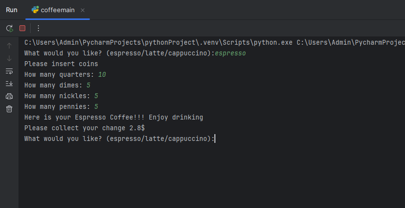

# ☕ Coffee Machine Simulator

A console-based Coffee Machine Simulator that allows users to purchase espresso, latte, or cappuccino using virtual coins. The machine keeps track of its inventory, processes payments, and provides real-time reports.

---

## 🎯 Features

- 👨‍💻 Command-line interaction  
- 💰 Simulated coin-based payment system (quarters, dimes, nickels, pennies)  
- 📊 Real-time machine report: water, milk, coffee, and collected money  
- 🧮 Resource checking before dispensing coffee  
- 🔁 Infinite loop to keep the machine running until turned off  

---

## 📋 Menu Options

Users can choose from:
- `espresso` – requires 50ml water, 18g coffee → $0.50  
- `latte` – requires 200ml water, 150ml milk, 24g coffee → $2.50  
- `cappuccino` – requires 250ml water, 100ml milk, 24g coffee → $3.00  
- `report` – display machine's resource status  
- `off` – shut down the machine  

---

## 🛠️ How It Works

1. Program runs in a loop asking for a drink.
2. Checks if sufficient ingredients are available.
3. Prompts the user to input virtual coins.
4. Dispenses drink if the payment is enough and returns change.
5. Updates resource levels after each purchase.

---

## ▶️ How to Run

1. Clone the repository or copy the code into a `.py` file.
2. Open terminal or command prompt.
3. Run the script:
   ```bash
   python coffee_machine.py
   ```

---

## 📸 Screenshots

<div>
  &emsp;&emsp; 

</div>


---

## 🧠 Concepts Used

- Python functions and loops  
- Conditional statements  
- Simulated resource management  
- Basic arithmetic and type casting  
- Clean CLI design  

---

## 🙋‍♂️ Author

**Santhosh Kumar P S**  
📧 Email: santhoshkumarsakthi2003@gmail.com
