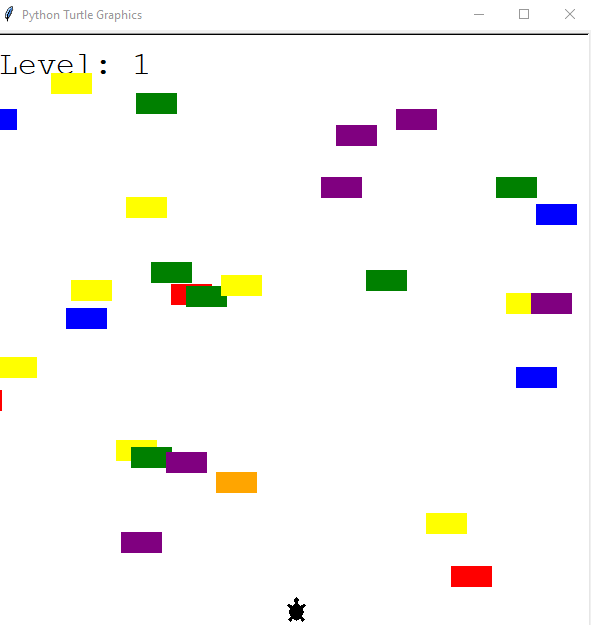
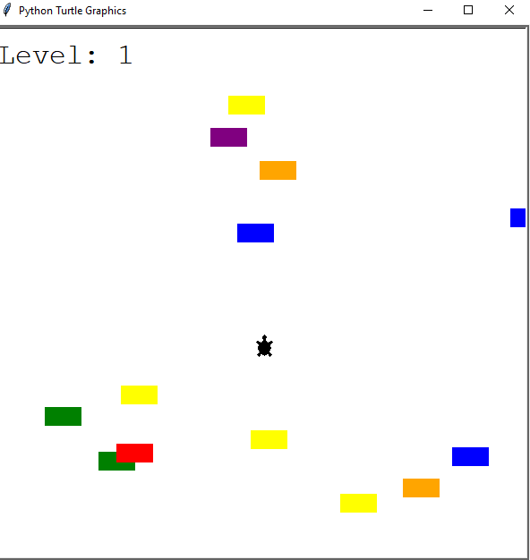
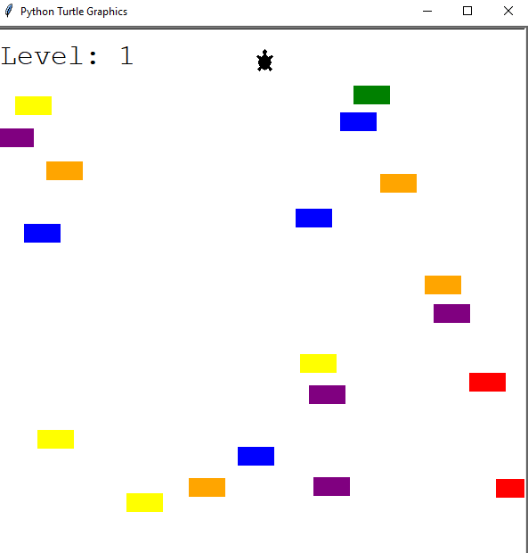
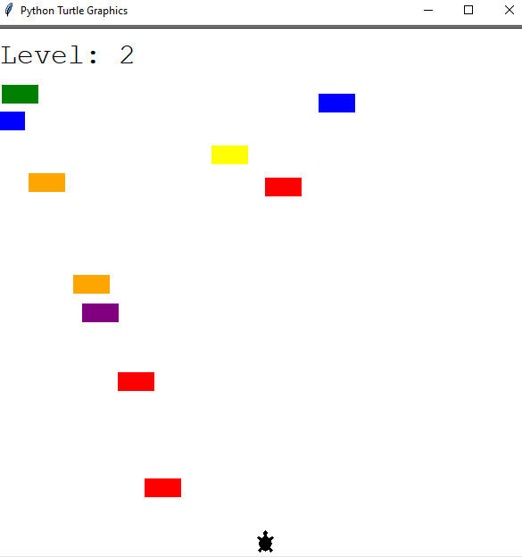
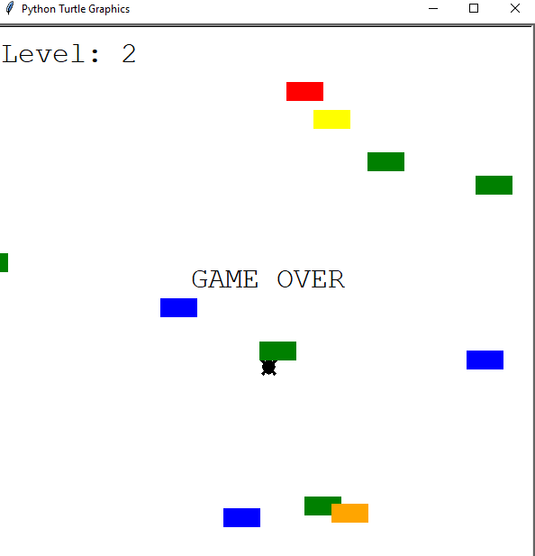

# 🐢 Crossing Turtle Game

A fun, colorful arcade-style Python game where the player controls a turtle trying to cross a busy road filled with moving cars. Built using Python’s Turtle Graphics module, the game gets harder with each level as car speed increases!

---

## 🎮 Game Features

- 🚦 Colorful cars moving horizontally across the screen  
- 🐢 Player controls a turtle to cross from bottom to top  
- 🧠 Level increases as player crosses successfully  
- 💨 Cars move faster with each level  
- 💥 Collision detection ends the game  
- 📈 Scoreboard shows the current level

---

## 🛠️ How It Works

1. The player presses the **Up Arrow** to move the turtle upward.
2. Randomly generated cars move across the screen from right to left.
3. Each time the turtle reaches the finish line, the level increases and car speed increases.
4. If the turtle hits a car, the game ends with a **GAME OVER** screen.

---

## ▶️ How to Run

1. Clone this repository or copy the `.py` files into a folder.
2. Run the main game file in your terminal or IDE:
   ```bash
   python main.py

---

## 🧩 Files & Structure
- main.py – Initializes the game loop and handles collision & level checks

- player.py – Controls turtle movement and reset functionality

- car_manager.py – Manages car creation, movement, and speed

- scoreboard.py – Displays current level and Game Over message

---

## 📸 Screenshots
<div align="center"> 
&emsp; 
&emsp;
&emsp;
&emsp;
 

</div>

---

## 📚 Concepts Used
- Python Turtle Graphics

- OOP (Object-Oriented Programming) with classes

- Random number and color generation

- Keyboard event handling

- Collision detection logic

- Game loops and animation timing
---

## 🚀 Future Improvements
- ⏳ Add countdown timer

- 🎨 Add background music and sound effects

- 🧠 Multiple difficulty levels

- 💾 Save high scores
---

## 🙋‍♂️ Author
**Santhosh Kumar P S**

📧 Email: santhoshkumarsakthi2003@gmail.com
