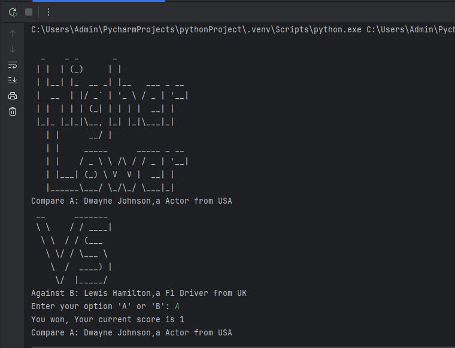
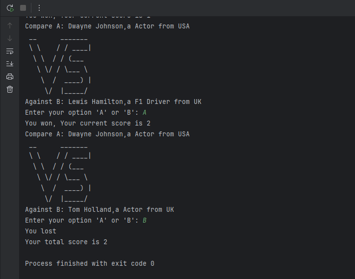

# 🔢 Higher or Lower Game – Python CLI App

A fun, console-based game where you compare the Instagram followers of two celebrities and guess who has more. The game continues as long as you guess correctly — test your intuition and see how high you can score!

---

## 🎯 Features

- 🎮 Simple and interactive command-line interface  
- 🌍 Real-world celebrity data (name, profession, country)  
- 🔁 Continuous gameplay until wrong guess  
- 🏆 Score tracking  
- 🔀 Randomized data for fresh gameplay each round  

---

## 🕹️ How to Play

1. Two celebrities are shown with their name, profession, and country.
2. You need to guess who has more followers by entering **'A'** or **'B'**.
3. If you're right, your score increases and the next round starts.
4. If you're wrong, the game ends and your final score is shown.

---

## 📦 Data Used

Each celebrity object includes:
- `name`: Celebrity's name  
- `career`: Their profession  
- `place`: Country of origin  
- `followers`: Instagram follower count


---

## 🧠 Concepts Used

- Python lists and dictionaries

- Conditional logic and loops

- Random selection

- Function design and user input handling

- Terminal-based interactivity
---

## ▶️ How to Run

1. Make sure you have Python installed.
2. Clone the repository or download the files.
3. Run the script:
```bash
python higher_lower_game.py
```
---

## 📸 Screenshots

<div>
  &emsp;&emsp; 
     


</div>

---

## 🙋‍♂️ Author

**Santhosh Kumar P S**  
📧 Email: santhoshkumarsakthi2003@gmail.com
