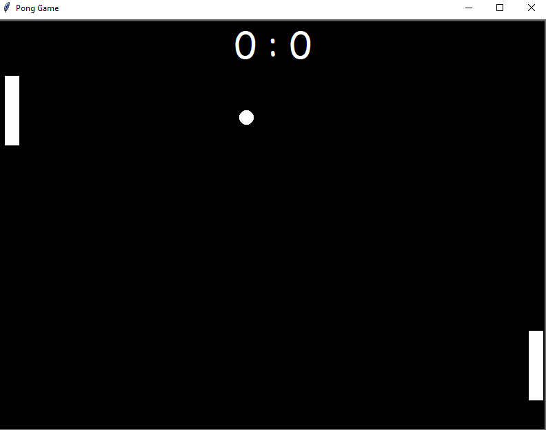
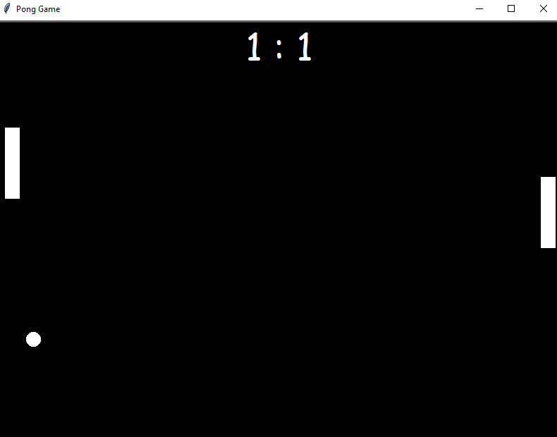

# 🏓 Pong Game – Classic Retro Arcade in Python

Recreate the nostalgic **Pong** game using Python's Turtle Graphics! This classic 2-player game allows you to control paddles and bounce a ball back and forth while tracking scores in real-time.

---

## 🎯 Features

- 🕹️ Two-player controls (W/S for Player 1, Up/Down for Player 2)
- 🎱 Realistic ball movement and collision
- 🧠 Scoreboard tracking for both players
- 🔁 Ball resets after missing paddle
- 💨 Speed increases with each successful hit for added challenge
- 🎨 Clean and minimalistic design using Turtle graphics

---

## 🛠️ How It Works

1. **Paddles** are controlled using keyboard keys:
   - Player 1 (Left): `W` (up), `S` (down)
   - Player 2 (Right): `Up Arrow`, `Down Arrow`

2. The **ball** starts in the center and moves diagonally.
3. If it hits the top or bottom walls, it **bounces back** vertically.
4. If it hits a paddle, it **bounces horizontally** and **speeds up**.
5. If a player **misses the ball**, the opponent gains a point.
6. The score is updated and the ball resets to the center.

---

## ▶️ How to Run

1. Clone or download this repository.
2. Ensure all `.py` files (`main.py`, `paddle.py`, `ball.py`, `scorecard.py`) are in the same folder.
3. Run the game using:
   ```bash
   python main.py

---

## 📂 File Structure
- main.py – The main game loop and screen setup

- paddle.py – Paddle class for both players

- ball.py – Ball movement and bounce logic

- scorecard.py – Tracks and displays player scores

---

## 📸 Screenshots
<div align="center"> 
&emsp; 
   
</div>

---
## 📚 Concepts Used
- Turtle Graphics for GUI

- OOP: Custom classes for modular design

- Collision detection

- Keyboard input handling

- Game loop and screen refresh techniques

- Custom fonts and on-screen text rendering


---
## 🙋‍♂️ Author
**Santhosh Kumar P S**

📧 Email: santhoshkumarsakthi2003@gmail.com

#### Let the best player win! 🏆

