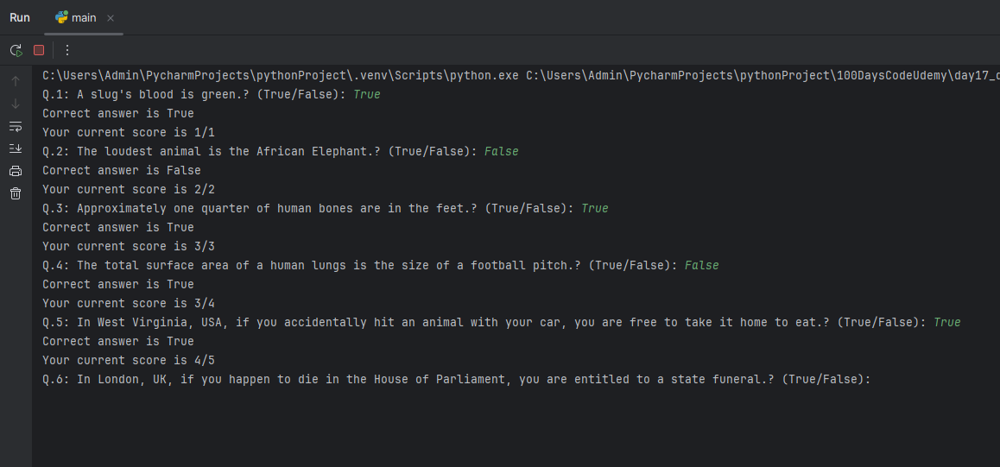

# 🧠 True or False Quiz Game – Python CLI App

A console-based quiz game where you're presented with fun and surprising true/false statements. Test your knowledge and see how many you get right in a row!

---

## 🎯 Features

- 🧠 Interesting real-world trivia
- 📋 Command-line user interaction
- ✅ Answer validation and immediate feedback
- 🔁 Keeps going until all questions are answered
- 🏆 Tracks and displays your current and final score

---

## 🕹️ How to Play

1. You'll be shown a series of statements.
2. For each one, type `True` or `False` and hit Enter.
3. The game tells you if you're correct and updates your score.
4. Once all questions are answered, your final score is shown.

---

## 📦 Data Used

Each question includes:
- `text`: The statement to be answered
- `answer`: The correct answer (`"True"` or `"False"`)

---

## ▶️ How to Run

1. Make sure you have Python installed.
2. Copy the full code below into a file named `quiz_game.py`.
3. Open your terminal or command prompt.
4. Run the program:

```bash
python quiz_game.py
```
---

## 🧠 Concepts Used

- Python classes and object-oriented programming
- Loops and conditional logic
- CLI-based user interaction
- List comprehension
- Input validation

---
## 📸 Screenshots

<div>
  &emsp;&emsp; 

</div>

---

## 🙋‍♂️ Author

**Santhosh Kumar P S**  
📧 Email: santhoshkumarsakthi2003@gmail.com
