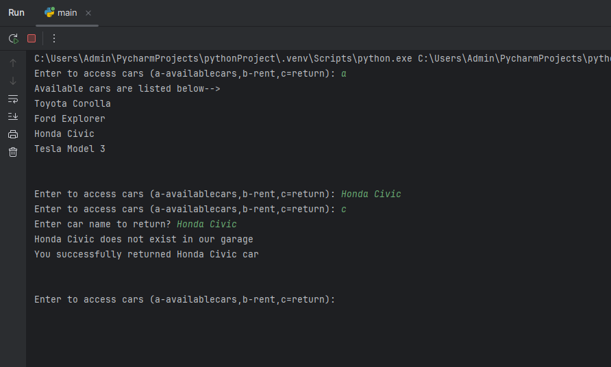

# 🚗 Car Rental System – Python CLI App

A simple, command-line Car Rental System that allows users to view available cars, rent them, and return them. This Python-based program simulates a car rental garage with availability tracking.

---

## 🎯 Features

- 🧾 View all available cars
- 🚘 Rent a car (if available)
- 🔁 Return a rented car
- 🧠 Tracks availability dynamically
- 🛑 Option to exit anytime

---

## 🕹️ How to Use

1. Run the program.
2. Choose an option:
   - `a` – Show all available cars.
   - `b` – Rent a car by name.
   - `c` – Return a car by name.
   - `off` – Exit the program.
3. The system updates availability accordingly.

---

## 📦 Data Used

Each car dictionary includes:
- `name`: Name of the car (e.g., `"Toyota Corolla"`)
- `type`: Type of car (e.g., `"SUV"`, `"Sedan"`)
- `available`: Boolean value representing availability

---

## ▶️ How to Run

1. Make sure Python is installed.
2. Copy all the code below into a single file named `car_rental.py`.
3. Open your terminal or command prompt.
4. Run the script:

```bash
python car_rental.py
```

---

## 🧠 Concepts Used

- Python classes and objects
- List and dictionary handling
- Conditional statements and loops
- String comparison
- CLI-based interactivity

---

## 📸 Screenshots

<div>
  &emsp;&emsp; 

</div>

---

## 🙋‍♂️ Author

**Santhosh Kumar P S**  
📧 Email: santhoshkumarsakthi2003@gmail.com
