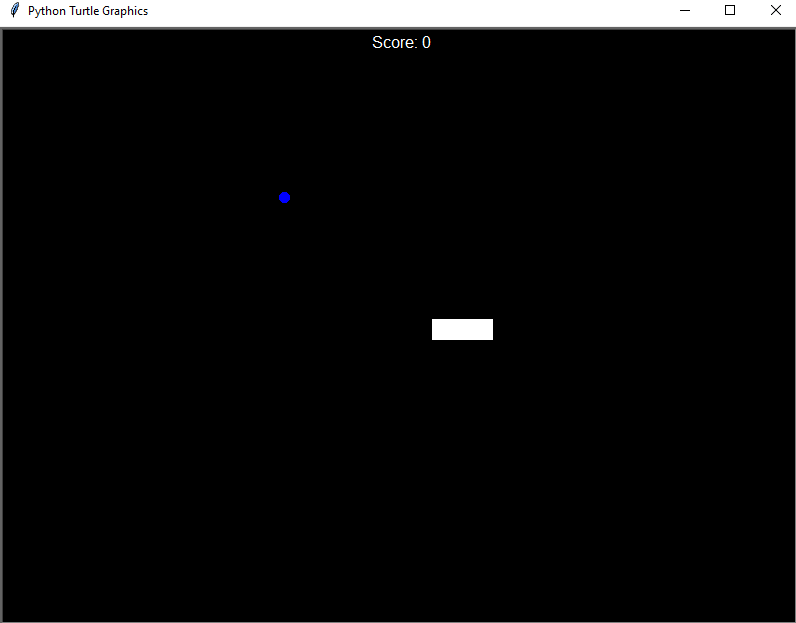
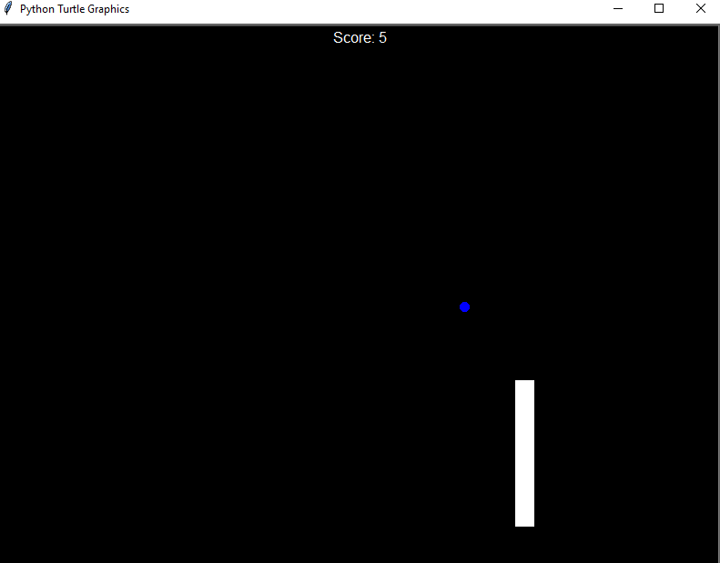
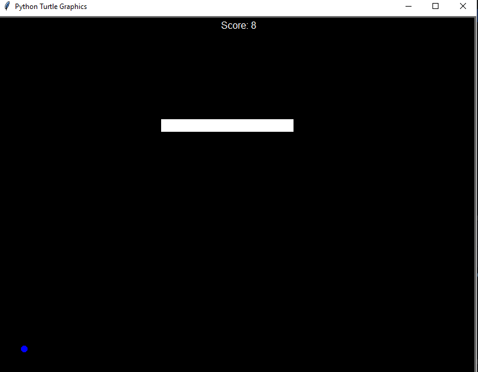
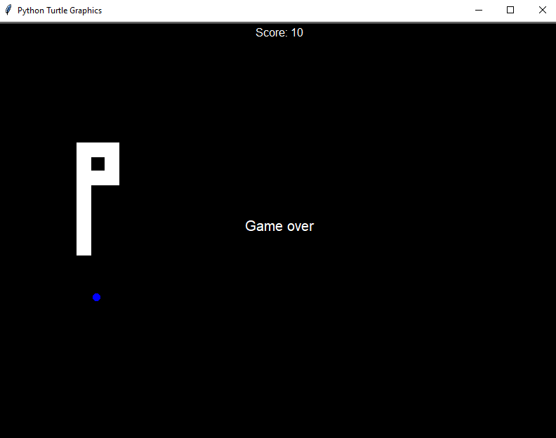
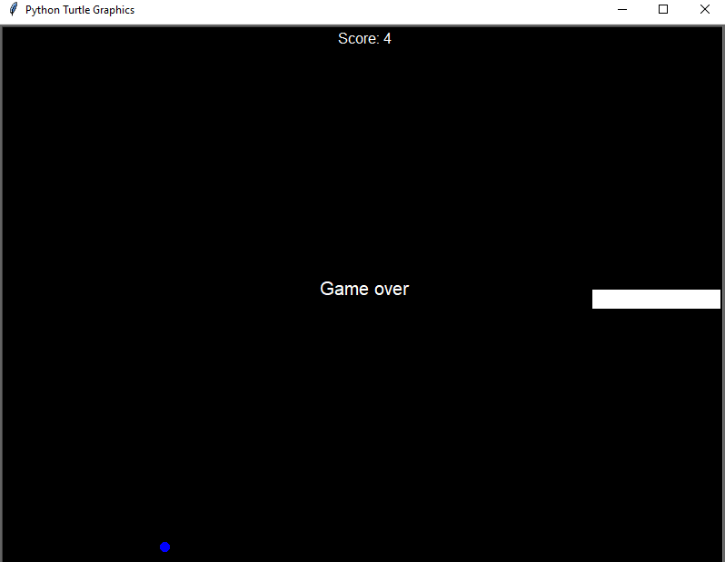

# 🐍 Snake Game – Python Turtle App

A fun and interactive **Snake Game** built using Python's Turtle Graphics library.  
Eat the food, grow longer, and avoid crashing into walls or yourself!

---

## 🎯 Features

- 🐍 Classic snake movement with arrow keys
- 🍎 Randomly placed food that increases your score
- 💥 Game over when the snake hits walls or itself
- 🧠 Keeps score dynamically

---

## 🕹️ How to Play

1. Run the game script.
2. Use the arrow keys to move the snake:
   - `Up` ⬆️  
   - `Down` ⬇️  
   - `Left` ⬅️  
   - `Right` ➡️  
3. Eat the food to grow longer and score points.
4. Avoid:
   - Crashing into the walls
   - Crashing into yourself
5. Game over message is displayed on failure.

---

## 📦 File Structure

- `main.py` → Runs the game loop and handles all game logic  
- `mysnakeclass.py` → Contains the `Snake` class for snake creation, movement, and growth  
- `scoreboard.py` → Displays the current score and game over message  
- `food.py` → Handles random food placement

---

## ▶️ How to Run

1. Ensure you have **Python installed** (version 3+).
2. Clone or download the repository.
3. Place all files in one folder:
   - `main.py`
   - `mysnakeclass.py`
   - `scoreboard.py`
   - `food.py`
4. Open terminal and navigate to the folder.
5. Run the game using:

```bash
python main.py
```

---
## 🧠 Concepts Used
- Object-Oriented Programming (OOP)

- Turtle Graphics

- Collision Detection

- Keyboard Event Handling

- Game Loop using time.sleep()

---
## 📸 Screenshots

<div align="center">
   
   
   
   
   


</div>

---

## 🙋‍♂️ Author
**Santhosh Kumar P S**

📧 Email: santhoshkumarsakthi2003@gmail.com

---

## ❤️ Enjoy Playing!

If you enjoyed this project, feel free to ⭐ the repository and suggest improvements!
---
