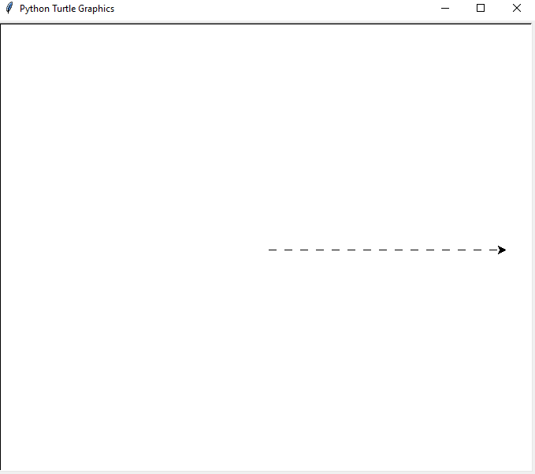
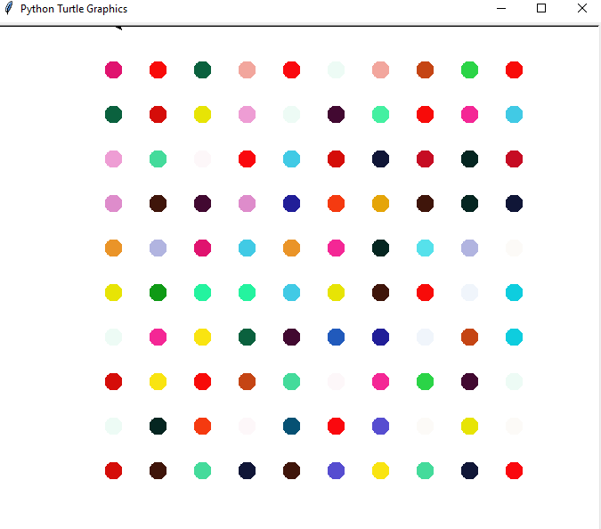
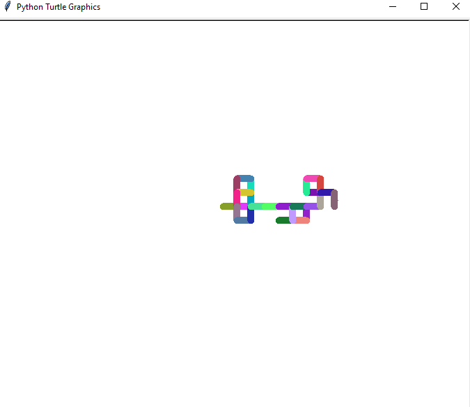
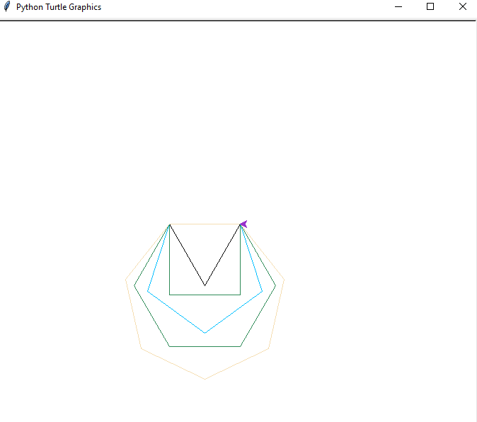
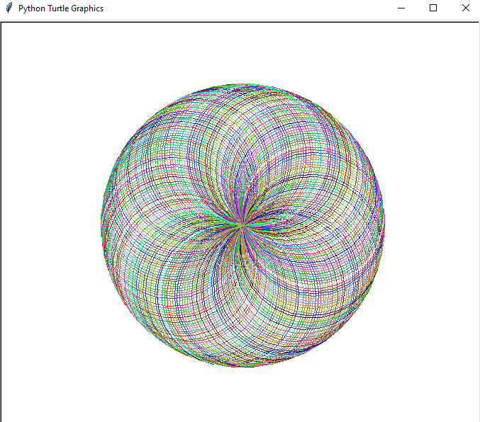

# 🐢 Turtle Graphics Showcase – Python Project

A visually rich collection of **Turtle graphics** in Python to demonstrate fundamental concepts like loops, color manipulation, shapes, dot painting, spirals, random walks, and color extraction using `colorgram`.

---

## 🎯 Features

- 📏 Dashed line drawing
- 🎯 10x10 Dot Painting (inspired by Hirst's style)
- 🌈 Random color extraction from an image
- 🌀 Random walks with bold strokes
- 🧩 Drawing increasing-sided polygons
- 🎨 Rainbow spiral pattern

---

## ▶️ How to Run

1. Install Python from [python.org](https://www.python.org).
2. Install the required module for color extraction:
   ```bash
   pip install colorgram.py

3. Save this file as turtle_drawings.py.
4. Ensure the file image1.jpg exists in the same directory (for the colorgram extraction).
5. Run the script:
   ```bash
    python turtle_drawings.py

---

## 📦 Dependencies

- turtle – Built-in Python graphics module

- random – For generating randomness

- colorgram – To extract colors from images (pip install colorgram.py)

--- 

## 🧠 Concepts Used

- Turtle graphics

- Loops and conditions

- RGB color manipulation

- Dot painting and screen positioning

- Randomized walk and direction

- Shape drawing logic


---

## 📸 Screenshots

<div align="center">
  
  
  
  
  

</div>

---

## 🙋‍♂️ Author

**Santhosh Kumar P S**  
📧 Email: santhoshkumarsakthi2003@gmail.com
